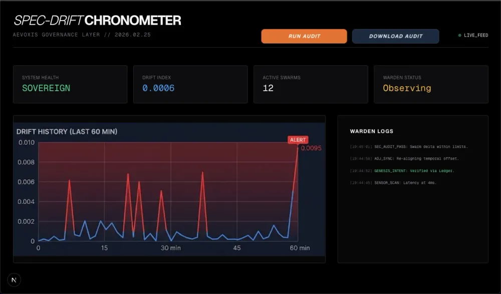

*Developed for the AWS 10,000 AIdeas Competition 2025 | 
Top 300 Finalist from over 10,000 global submissions*

**Built by Vinita Silaparasetty, AI Governance Engineer | 
Aevoxis Solutions | aevoxis.de**

[Read the official project submission on AWS Community Builder](https://builder.aws.com/content/3ArZsXU7l4aaXPzFdXH0DdlyaM4/aideas-spec-drift-chronometer)
---

# Aevoxis Warden Engine: Spec-Drift Chronometer



## EU AI Act Alignment

| Requirement | Implementation |
|---|---|
| Article 14: Human Oversight | Justification Gate blocks execution until human approval |
| Article 12: Record Keeping | Deterministic audit trail exported on every governance decision |
| Article 13: Transparency | Real-time drift coefficient visible to all stakeholders |
| Article 50: Disclosure | System identifies itself as AI-governed at every interaction point |


## What This Solves

Enterprises deploying autonomous AI systems face a critical 
governance problem: how do you detect when an AI system has 
drifted from its original human-approved specification, and 
how do you enforce accountability when it does?

The Spec-Drift Chronometer monitors autonomous AI outputs in 
real time, detects misalignment between human intent and system 
behaviour, and triggers a Human-in-the-Loop Justification Gate 
before any non-compliant action is executed.

EU AI Act Article 14 human oversight requirements are engineered 
directly into the architecture, not added as an afterthought. 
Deployed on AWS Lambda, Frankfurt region (eu-central-1) for 
EU data residency compliance.

---

## How It Works

**Drift Detection:** The system continuously monitors autonomous 
AI outputs against the original human-approved specification 
stored in the governance ledger. Any deviation triggers an alert.

**Human-in-the-Loop Justification Gate:** When drift is detected, 
the system halts execution and requires a human to provide a 
documented business justification before proceeding. This 
justification is evaluated against EU AI Act Article 14 guardrails 
in real time.

**Audit Trail:** Every drift event, justification, and governance 
decision is logged as a downloadable, deterministic record suitable 
for regulatory reporting.

---

## Tech Stack

- Frontend: Next.js (React) with Tailwind CSS
- Backend: FastAPI (Python) with Mangum
- Infrastructure: AWS Lambda, Frankfurt region (eu-central-1)
- AI Layer: Amazon Bedrock AgentCore and Strands SDK
- Governance: Kiro-compliant steering and policy ledger

---

## Quick Start

**1. Backend**

```bash
cd backend
pip install -r requirements.txt
uvicorn main:app --reload
```

Ensure your .kiro/steering vault is populated with your 
human-intent specifications before starting.

**2. Frontend**

```bash
cd frontend
npm install
npm run dev
```

Open http://localhost:3000 to access the dashboard.

**3. Run a Drift Audit**

Trigger a drift event by modifying a resource in your AWS 
Sandbox (for example, changing an S3 bucket policy). Click 
Run Audit on the dashboard. If drift is detected, the 
Justification Gate will activate. Download the Audit Trail 
for compliance reporting.

---

## About

Built by Vinita Silaparasetty, AI Governance Engineer and 
founder of Aevoxis Solutions, operating under SMartDe eG, Germany.

Website: https://aevoxis.de
LinkedIn: https://linkedin.com/in/vinita-silaparasetty
Email: info@aevoxis.de
