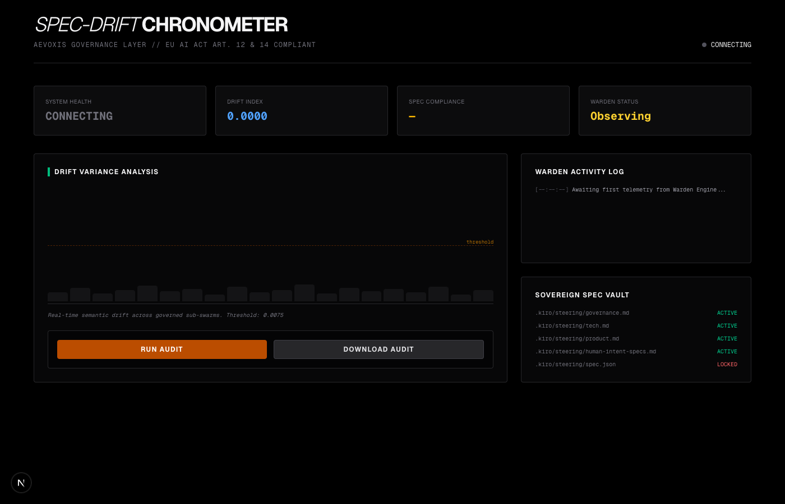
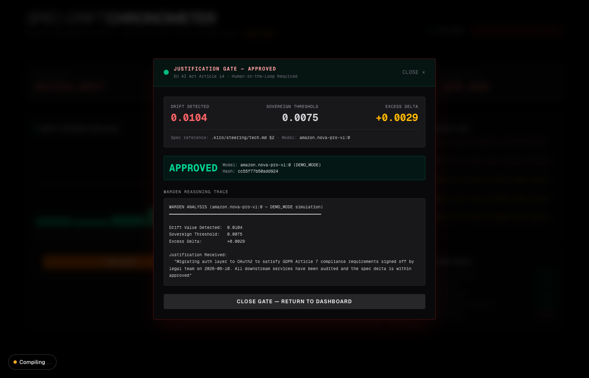

# Aevoxis Warden Engine: Spec-Drift Chronometer

[](LICENSE)
[](https://www.python.org/)
[](https://aevoxis.de)

AI governance platform that detects semantic drift between human-authored architectural intent and AI-generated code in real time. Enforces EU AI Act Articles 12, 13, 14 & 50 directly in the execution path — not as a process document.

*Built by [Vinita Silaparasetty](https://aevoxis.de), AI Governance Engineer, Aevoxis Solutions*

**[Live Demo](https://spec-drift-chronometer.aevoxis.de)**

---



> Normal operating state. Drift within threshold, status SOVEREIGN, all governance indicators green.



> Article 14 enforcement end-to-end: drift crossed threshold, human submitted justification, Warden Agent returned APPROVED with Intent Alignment Score 91/100.

---

## EU AI Act Alignment

| Requirement | Implementation |
|---|---|
| Article 14: Human Oversight | Justification Gate blocks execution until human approval |
| Article 12: Record Keeping | SHA-256-verified audit trail on every governance decision |
| Article 13: Transparency | Real-time drift coefficient visible to all stakeholders |
| Article 50: Disclosure | System identifies itself as AI-governed at every interaction point |

---

## Features

| Feature | Description |
|---------|-------------|
| **Drift Detection** | Polls a live drift index every 3 seconds. Real-time bar chart coloured by severity. |
| **Justification Gate** | When drift crosses the sovereign threshold, an Article 14-compliant gate appears. No action proceeds without human sign-off. |
| **Warden Agent** | Submits justification to Amazon Nova Pro and returns a structured reasoning trace with an Intent Alignment Score. |
| **Audit Trail** | Every governance event logged to `.kiro/audit/last_sync.audit` with a verification hash — downloadable from the dashboard. |
| **Spec Vault** | Human intent specs in `.kiro/steering/`. The Warden cross-references every decision against these files. |

---

## Quickstart

**Requirements:** Python ≥ 3.12, Node.js ≥ 18, npm ≥ 9

```bash
git clone https://github.com/VinitaSilaparasetty/spec-drift_chronometer.git
cd spec-drift_chronometer
chmod +x dev.sh
DEMO_MODE=true ./dev.sh
```

Open **http://localhost:3000**. No AWS credentials needed.

**Demo flow (~45 seconds):**
1. Drift rises through MONITORING into CRITICAL_DRIFT
2. The Justification Gate modal appears
3. Submit a justification → Warden returns APPROVED or REJECTED with reasoning trace
4. Click **Run Audit** → **Download Audit** to export the Article 12 audit trail

---

## Connecting to Your AI System

The Spec-Drift Chronometer wraps around AI systems you already have running — it does not replace the pipeline, it governs it. The integration below uses a LangChain RAG chatbot as an example. The same pattern applies to any LangChain-compatible chain, LangGraph graph, or agent.

```bash
cd integrations/langchain_rag
cp .env.example .env        # add your OPENAI_API_KEY
pip install -r requirements.txt
python check.py             # verify setup before running
python rag_chatbot.py
```

```python
from warden_client import WardenClient
from warden_callback import WardenCallbackHandler

warden = WardenClient(base_url="https://your-warden-api.example.com")
handler = WardenCallbackHandler(warden, dashboard_url="https://your-dashboard.example.com")

# This single line wires EU AI Act Article 14 governance into your existing chain
rag_chain = (your_existing_chain).with_config(callbacks=[handler])
```

When the gate triggers, chain execution is blocked and the operator is directed to the governance dashboard to submit a justification. The Warden Agent evaluates it and returns APPROVED or REJECTED. The gate clears only on approval.

Full integration code, a LangGraph example, and setup verification are in [`integrations/langchain_rag/`](integrations/langchain_rag/).

Having trouble connecting? See the [Troubleshooting](https://aevoxis.de/blog/eu-ai-act-langchain-rag-integration#troubleshooting) section of the integration guide.

---

## Architecture

```
┌──────────────────────────────────────────────────────┐
│                     Browser                          │
│   Next.js Dashboard (port 3000)                      │
│   ├── DriftDashboard  — real-time chart + logs       │
│   ├── JustificationGate — Article 14 modal           │
│   └── GovernanceActions — audit buttons              │
└────────────────────┬─────────────────────────────────┘
                     │ HTTP (NEXT_PUBLIC_API_URL)
┌────────────────────▼─────────────────────────────────┐
│   FastAPI Warden Engine (port 8000)                  │
│   ├── GET  /drift          — live drift index        │
│   ├── GET  /gate/status    — gate state              │
│   ├── POST /gate/submit    — invoke Warden Agent     │
│   ├── POST /audit          — generate audit file     │
│   └── GET  /download-audit — serve audit file        │
└────────────────────┬─────────────────────────────────┘
                     │ boto3 (PRODUCTION only)
┌────────────────────▼─────────────────────────────────┐
│   AWS eu-central-1                                   │
│   ├── Amazon Bedrock  — nova-pro-v1:0 reasoning      │
│   └── DynamoDB        — Intent Ledger (optional)     │
└──────────────────────────────────────────────────────┘
```

**Spec Vault (`.kiro/steering/`)** — human-authored intent the Warden cross-references on every decision:

| File | Purpose |
|------|---------|
| `governance.md` | Warden persona and negotiation protocol |
| `tech.md` | Technology constraints |
| `human-intent-specs.md` | Architect declarations (INTENT-001 … INTENT-006) |
| `spec.json` | Machine-readable thresholds and model config |

---

## Production Setup

```bash
cp .env.example .env
# Set AWS_ACCESS_KEY_ID, AWS_SECRET_ACCESS_KEY, AWS_REGION=eu-central-1, DEMO_MODE=false
DEMO_MODE=false ./dev.sh
```

**IAM permissions required:**
```
bedrock:InvokeModel    (amazon.nova-pro-v1:0 and amazon.nova-lite-v1:0)
dynamodb:PutItem       (optional — for durable audit trail)
dynamodb:GetItem
```

AWS Lambda deployment is supported via the included `Dockerfile` and `Procfile`. See `.env.example` for all configuration options.

---

## Environment Variables

| Variable | Default | Description |
|----------|---------|-------------|
| `DEMO_MODE` | `true` | `false` enables live AWS Bedrock |
| `DRIFT_THRESHOLD` | `0.0075` | Drift value that triggers the gate |
| `NEXT_PUBLIC_API_URL` | `http://localhost:8000` | Backend URL for the frontend |
| `AWS_REGION` | `eu-central-1` | Frankfurt — required for EU data sovereignty |
| `WARDEN_LLM` | *(unset)* | Override the justification evaluator: `gemini`, `huggingface`, or `mistral` |
| `GEMINI_API_KEY` | — | Required when `WARDEN_LLM=gemini` |
| `HF_API_KEY` | — | Required when `WARDEN_LLM=huggingface` |
| `MISTRAL_API_KEY` | — | Required when `WARDEN_LLM=mistral` |

When `WARDEN_LLM` is unset the Warden defaults to Amazon Nova Pro via Bedrock in production and the built-in mock in demo mode.

---

## Tech Stack

- **Frontend:** Next.js 16 / React 19 / Tailwind 4 — Cloudflare Pages
- **Backend:** FastAPI / Python 3.12 / Mangum — Render
- **AI:** Amazon Bedrock (Nova Pro — justification analysis, Nova Lite — drift scoring)
- **Governance:** Spec Vault with real semantic git diff analysis

---

## Sample Audit Trail

```
╔══════════════════════════════════════════════════════════════╗
║      SPEC-DRIFT CHRONOMETER — SOVEREIGN AUDIT TRAIL         ║
╚══════════════════════════════════════════════════════════════╝

Timestamp:          2026-06-14 15:24:15 UTC
Drift Index:        0.0082  |  Threshold: 0.0075  |  Gate: RESOLVED
Spec Hash:          bf40efdc39297d64  |  Run Hash: cdfa7ff9a941820f

── GOVERNANCE COMPLIANCE ──────────────────────────────────────
EU AI Act Article 14 (Human Oversight):   VERIFIED
EU AI Act Article 12 (Record Keeping):    VERIFIED
Sovereign Region:                          eu-central-1 (Frankfurt)

── JUSTIFICATION GATE RECORD ──────────────────────────────────
Decision:         APPROVED
Justification:    Migrating auth layer to OAuth2 to satisfy GDPR Article 7
                  compliance requirements signed off by legal team on 2026-06-10.
══════════════════════════════════════════════════════════════
```

Downloadable directly from the dashboard. A weak justification scores 29/100 and is REJECTED — the gate is not a rubber stamp.

---

## Research

The `test_research/` folder contains the empirical test suite used to generate data for an IEEE Software paper on EU AI Act compliance failure modes. It includes two test runners:

- `run_tests.py` — three-phase test: real drift measurement across git commits, justification gate evaluation across nine quality levels (WEAK / MEDIUM / STRONG), and audit trail generation
- `run_failure_modes.py` — eight structured failure mode tests covering Articles 12, 13, 14, and 17

Results across all test runs are in `test_research/results/`. The headline finding from the failure mode suite: a 10-line addition to the spec vault reduced drift detection for an entire vocabulary domain from 0.0113 to 0.0044, crossing the gate threshold in reverse and silencing detection permanently — a gap not visible from reading Article 13(3b) alone.

To run the justification gate tests against a live backend:

```bash
source venv/bin/activate
DEMO_MODE=false WARDEN_LLM=mistral MISTRAL_API_KEY=your-key \
  python -m uvicorn backend.main:app --port 8000 &

cd test_research
pip install -r requirements.txt
python run_tests.py --llm mistral
```

---

## License

Licensed under AGPL-3.0. For commercial licensing or enterprise deployment, contact [info@aevoxis.de](mailto:info@aevoxis.de)
